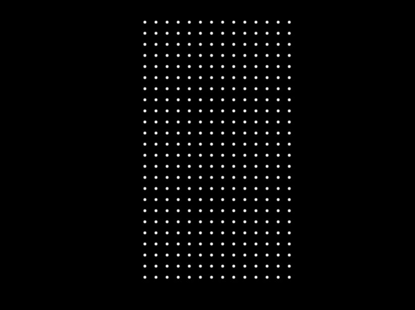

# 1 Dots

Conceived on: 2022-11-18



## Description

I'm visualizing a canvas with a "connect-the-dots" layer that oscillates between
visible and invisible. At points of invisibility, a random path of dots will be
connected, forming a line, and the rest will fade.

### Specification Example

For the purposes of making this easy to protoype, imagine a 3x3 dot grid. At
scale the grid will be much larger (the size of the canvas).

#### Phases

##### Phase 1: Blank

```text


```

##### Phase 2: Matrix Appears

```text
. . .
. . .
. . .
```

##### Phase 3: A Line is Formed

The line must form at least N connections and cannot cover the same path twice.

```text
._. .
. |_.
. . .
```

##### Phase 4: The Line is Emphasized

```text
 _
  |_
```

##### Phase 5 (Terminal): Fade

At this point the dot connection disappears and we're back to Phase 1.

I have an idea of storing each drawing that's formed somewhere/somehow.

Perhaps a "Gallery" of symbols can be formed, like so:

```text
 _    \_
  |_    \

--  --
  |_|
```

It is unknown where this would display

#### Look & Feel

The look feel should be black/white/greyscale and ideally ominous to some
degree.

##### Transitions, Animations

In an ideal implementation, there are semi-random transitions. Transitions
should include non-linear fades, flashes of light for reveals.

##### Ambience

In terms of ambience, there could be things happening around the canvas in the
background, perhaps. Or at least a non-blank background. This is TBD.
